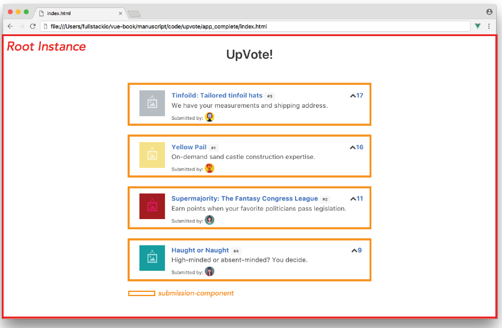

# Fullstack Vue 3 The Complete Guide to Vue.js

## 1. How to get the most out of this book
## 2. Your first vue.js application
## 3. Single-file components
## 4. Custom Events
## 5. Introduction to Vuex
## 6. Vuex and Servers
## 7. Form Handling
## 8. Routing
## 9. Unit Testing
## 10. Composition API
## 11. TypeScript
## 12. Vue Apollo & GraphQL
## 13. Fullstack Vue Screencast

---
---

# 1. How to get the most out of this book

\-

# 2. Your first vue.js application

## The Application Instance

The application instance is the starting point of all Vue applications. An application instance accepts an options object which can contain details of the instance such as its template, data, methods, etc. The root level application instance also allows us to reference the DOM with which the instance is to be mounted/attached to

Let’s see an example of this by setting up the application instance for our app. We’ll write all our Vue code for the rest of this chapter inside the main.js file. Let’s open main.js and create the application instance using the Vue function:

```JavaScript
const upvoteApp = {};

Vue.createApp(upvoteApp).mount("#app");
```

We’re using the global createApp() API function³⁰ to create our application instance. The createApp() function takes an options object as its first parameter which specify the options and initial condition of our Vue app. As of now, we’re simply passing in an empty object with which we’ve declared above as upvoteApp.

The createApp() function allows us to chain functions to the global application instance. In the code sample above, we’re chaining a mount()³¹ function which allows us to specify the HTML element with the id of app to be the mounting point of our Vue application. Anywhere within this element can Vue JavaScript code now be used.

## Data binding

The simplest form of data binding in Vue is using the ‘Mustache’ syntax which is denoted by double curly braces {{}}. We’ll apply this syntax to bind all the text within our HTML (e.g. title, description, etc.).

The ‘Mustache’ syntax however cannot be used in HTML attributes like href, id, src etc. Vue provides the native v-bind attribute (this is known as a Vue directive) to bind HTML attributes. We’ll use this directive to update the src attributes in our template.

## Computed Properties

Computed properties are used to handle complex calculations of information that need to be displayed in the view.

## Components

Vue, like other modern-day JavaScript frameworks, provides the ability for users to create isolated components within their applications. Reusability and maintainability are some of the main reasons as to why components are especially important.

Components are intended to be self-contained modules since we can group markup (HTML), logic (JS) and even styles (CSS) within them. This allows for easier maintenance, especially when applications grow much larger in scale.



## Props

Vue gives us the ability to pass data from a parent component down to a child component with the help of props. In Vue, props are attributes that need to be given a value in the parent component and have to be explicitly declared in the child component. As a result, props can only flow in a single direction (parent to child), and never in the opposite direction (child to parent)

# 3. Single-file components

## Managing data between components

We’ve stressed that components should be as self-contained and isolated as much as possible. Taking into account the scope of our application - we know that there should be some level of communication between the components (e.g. submitting an event entry in CalendarEntry should surface an event on CalendarDay). This brings us to component communication and/or state management.

### Parent-Child Components

Since every component has it’s own isolated scope, child components can never (and should never) reference data directly from parent components. For a child component to access data from a parent, data has to flow from the parent down to the child with the help of props. This design greatly simplifies the understanding of an applications data flow since child components will never be able to mutate parent state directly.

### Child-Parent Components

Since props can only flow in a single direction from parent to child, children components can only directly communicate with a parent through custom events. Vue’s custom events work by triggering events within a particular component, $emit(nameOfEvent), and listening for that event in another component, $on(nameOfEvent). Data can also be passed through these events.

### Sibling Components

Managing data between sibling components are more difficult than that of parent-child (or childparent). Props cannot be used since sibling components are independent of one another (i.e. a sibling component isn’t rendered within another sibling component).

Managing data between sibling components in Vue can be categorized in three main buckets:

* Using a global event bus
* Using a simple, shared store object (for simple state management)
* Using the state management library Vue

# 4. Custom Events

\-